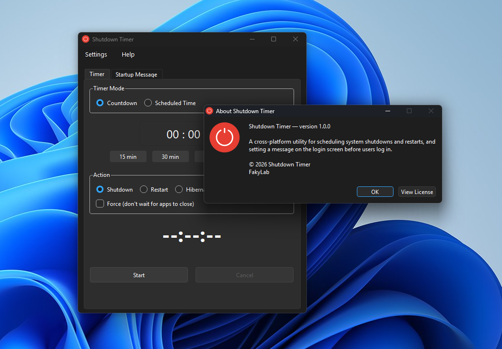
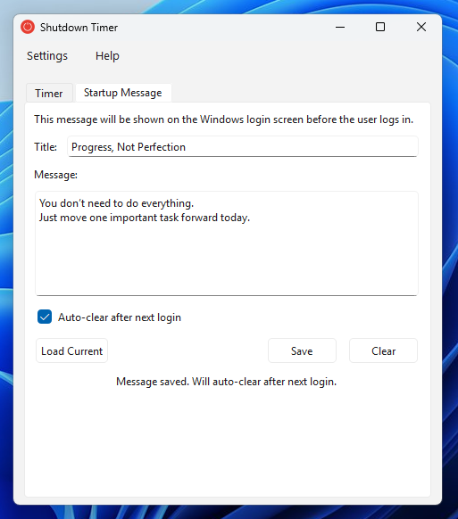

# Shutdown Timer

A cross-platform desktop utility for scheduling system shutdowns, restarts, hibernation, and sleep — and displaying a custom message on the login screen before users log in.

---

## Screenshots

| Timer Tab | Startup Message Tab |
|:---------:|:-------------------:|
|  |  |

---

## Features

- **Countdown Timer** — Set a duration (hours, minutes, seconds) and the system will perform the chosen action when it reaches zero. Quick preset buttons: 15 min, 30 min, 1 hour, 2 hours.
- **Scheduled Time** — Pick an exact date and time for the action using a calendar picker.
- **Shutdown, Restart, Hibernate, or Sleep** — Choose what happens when the timer fires. Shutdown and Restart support an optional *Force* mode that closes apps immediately without waiting for them to save. Hibernate and Sleep options are automatically greyed out if the machine doesn't support them, with a tooltip explaining why.
- **Live Countdown Display** — A large clock shows the remaining time while the timer is active. The system tray icon tooltip also updates in real time.
- **Startup Message** — Write a custom title and message body that will appear on the login screen. Uses the platform's native mechanism on each OS (see Platform Notes below).
- **Auto-Clear Message** — Optionally schedule the startup message to automatically remove itself after the next login.
- **System Tray** — The app minimizes to the system tray. Closing the window hides it rather than quitting. A tray menu lets you show/hide, cancel a running timer, or quit.
- **9 Languages** — English, Arabic (with RTL layout), Korean, Spanish, French, German, Portuguese (Brazil), Chinese Simplified, and Japanese. Language preference is saved between sessions.
- **Persistent Settings** — Window position, size, and language are all remembered across restarts.
- **Cross-platform** — Windows 10/11, Linux (SDDM / LightDM / GDM / PLM), and macOS 12+.

---

## Downloads

Pre-built packages are available on the [Releases](https://github.com/FakyLab/ShutdownTimer/releases) page:

| Platform | Package |
|----------|---------|
| Windows 10/11 (64-bit) | Portable ZIP |
| Linux x86\_64 | AppImage, .deb |
| macOS Intel (x86\_64) | DMG, ZIP |
| macOS Apple Silicon (arm64) | DMG, ZIP |

---

## Architecture

See [ARCHITECTURE.md](ARCHITECTURE.md) for the full MVC structure, layer interaction diagrams, platform backend selection logic, and Linux privileged helper design.

---

## How It Works

### Timer

When you click **Start**, `TimerController` validates the input and delegates to `TimerEngine`, which begins a 100ms poll loop. Rather than simply counting down, it recalculates the remaining time against the wall clock on every tick — this prevents drift if the computer sleeps or the timer is delayed. When the timer reaches zero, `TimerController` calls `IShutdownBackend::scheduleShutdown()`.

### Shutdown Backend

- **Windows** — `InitiateSystemShutdownExW` for Shutdown/Restart; `SetSuspendState` for Hibernate/Sleep. Acquires `SE_SHUTDOWN_NAME` privilege first.
- **Linux** — `systemctl hibernate/suspend` for sleep states; `shutdown --poweroff/--reboot` for Shutdown/Restart.
- **macOS** — `pmset sleepnow` for Sleep and Hibernate; `shutdown -h/-r` for Shutdown/Restart.

### Startup Message

The message is written to the platform-appropriate location using the platform's native API:

| Platform | Mechanism |
|----------|-----------|
| Windows | `HKLM\...\Winlogon` `LegalNoticeCaption` / `LegalNoticeText` (registry) |
| macOS | `loginwindow LoginwindowText` preference (primary) + `/Library/Security/PolicyBanner.txt/.rtf` (secondary) |
| Linux (.deb / AUR) | D-Bus → privileged helper → polkit authentication |
| Linux (AppImage) | pkexec shell script (password prompt per operation) |

On Linux, the message is written to `/etc/issue` as a universal TTY fallback, and to the active display manager's config:

| Display Manager | Config written |
|-----------------|----------------|
| SDDM / PLM (KDE) | `/etc/sddm.conf.d/shutdown-timer-msg.conf` |
| LightDM GTK | `/etc/lightdm/lightdm.conf.d/shutdown-timer-msg.conf` |
| LightDM Slick (Linux Mint) | `/etc/issue` only — slick-greeter has no text banner support |
| GDM (GNOME) | `/etc/dconf/db/gdm.d/01-banner-message` + `dconf update` |

### Auto-Clear

Schedules a one-shot task that runs `ShutdownTimer --auto-clear` headlessly at next login, clears all written locations, removes the task itself, and exits.

| Platform | Mechanism |
|----------|-----------|
| Windows | COM `ITaskService` — ONLOGON scheduled task |
| Linux | systemd user service (`shutdown-timer-autoclear.service`) |
| macOS | LaunchAgent plist (`com.fakylab.shutdowntimer.autoclear`) |

---

## Platform Notes

### Windows

- Writing to `HKLM\...\Winlogon` requires administrator privileges. The app requests elevation via UAC when needed.
- The auto-clear task runs with the highest available privilege at next login to clear the registry values.
- Hibernate and Sleep availability are detected at startup via `GetPwrCapabilities`.

### Linux

**The install method affects the privilege experience:**

- **`.deb` / AUR install** — A privileged D-Bus helper (`shutdowntimer-helper`) is installed at `/usr/libexec/`. It handles all root file writes and is protected by a PolicyKit action (`org.fakylab.shutdowntimer.write-message`). The password is requested **once per session** (`auth_admin_keep`) — you can save and update the login message multiple times without being asked again.

- **AppImage** — No system-level helper is installed. The app falls back to generating a shell script and running it via `pkexec`. A password prompt appears **on each save or clear** operation. All functionality is identical; only the authentication frequency differs.

Other notes:
- Display manager (SDDM / PLM / LightDM / GDM) is detected at runtime via `systemctl is-active`.
- The auto-clear feature uses a **systemd user service** — requires systemd (Ubuntu 16.04+, Fedora, Arch, etc.).
- GDM support writes a dconf banner key; `/etc/issue` is always written as a TTY fallback regardless of DM.

### macOS

- The app is **ad-hoc signed** — not notarized with Apple. On first launch, macOS may show a security warning. To open it: **right-click the app → Open**, then click **Open** in the dialog. After the first launch it opens normally.
- Writing the login screen message requires administrator access. A native macOS password dialog is shown when needed.
- The primary login message mechanism is `loginwindow LoginwindowText` (appears as a subtitle on the login screen). PolicyBanner files (`.txt` and `.rtf`) are also written for legal/compliance banner use cases.
- Sleep is always available; hibernate availability depends on `pmset hibernatemode`.
- Auto-clear uses a LaunchAgent at `~/Library/LaunchAgents/`.

---

## Building from Source

See [BUILDING.md](BUILDING.md) for full instructions. Quick reference:

### Prerequisites

| Tool | Version |
|------|---------|
| Qt6 (including Linguist tools) | 6.5 or newer |
| CMake | 3.20 or newer |
| C++ compiler (C++17) | GCC / Clang / MSVC |

**Linux only:** `libglib2.0-dev` and `libpolkit-gobject-1-dev` are required to build the privileged D-Bus helper. If not found at configure time, the helper is skipped and the app still builds and works fully (using the AppImage-style pkexec fallback instead).

### Build

**Windows (Qt MinGW prompt):**
```bat
cmake -B build -G "MinGW Makefiles" -DCMAKE_BUILD_TYPE=Release
cmake --build build --config Release
```

**Linux:**
```bash
cmake -B build -G Ninja -DCMAKE_BUILD_TYPE=Release
cmake --build build
```

**macOS:**
```bash
export CMAKE_PREFIX_PATH=$(brew --prefix qt6)   # if using Homebrew Qt
cmake -B build -DCMAKE_BUILD_TYPE=Release
cmake --build build
```

To clean the build: `rm -rf build`

---

## Requirements

| Platform | Minimum version | Notes |
|----------|----------------|-------|
| Windows | 10 (64-bit) | Administrator account required |
| Linux | Any modern distro with systemd | Root access via pkexec or polkit |
| macOS | 12 Monterey | Administrator account required |

---

## License

This project is licensed under the **GNU General Public License v3.0** — see the [LICENSE](LICENSE.txt) file for details.

---

## Credits

- **Shutdown icons** by [Bahu Icons](https://www.flaticon.com/authors/bahu-icons) — [Flaticon](https://www.flaticon.com/free-icons/shutdown) (free for personal and commercial use with attribution)
